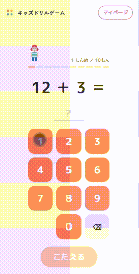

# キッズドリルゲーム

小学生向けの学習Webアプリ。小学1年生のたし算・ひき算から始めて、小学1〜6年生の算数や漢字のよみなどまで拡張予定。ポイントを貯めて着せ替えアバターを解放したり、タイムアタックモードでランキングを競ったりできる。



## 技術スタック

Next.js 16 (App Router) + TypeScript / Tailwind CSS v4 / Framer Motion / Neon Postgres (Drizzle ORM) / NextAuth (Credentials Provider) / Vercel

## セットアップ

```bash
npm install
cp .env.local.example .env.local  # DB接続情報などを埋める
npm run db:migrate
npm run dev
```

## コマンド

```
npm run dev      # 開発サーバー起動
npm run build    # 本番ビルド
npm run start    # 本番ビルドを起動
npm run lint     # ESLint
npm test         # Vitest（watch。1回だけ回すなら npx vitest run）
npm run db:generate  # スキーマ変更からマイグレーション生成
npm run db:migrate   # マイグレーション適用
```

## ドキュメント

設計の背景や判断理由は`docs/`にまとめている。

- [architecture.md](./docs/architecture.md) — 技術スタック・ホスティング・認証設計
- [game-design.md](./docs/game-design.md) — 難易度カーブ・モード設計・報酬ループ・ランキング設計
- [data-model.md](./docs/data-model.md) — DBスキーマとテーブル分割の理由
- [design.md](./docs/design.md) — デザインの方向性・トークン

## License

[MIT](./LICENSE)
